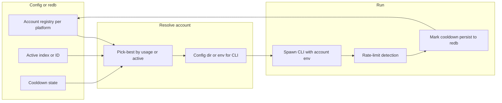

# Multi-Account Specification

**Status:** Single spec for implementation — another agent may derive an implementation plan from this document.  
**Cross-references:** Plans/rewrite-tie-in-memo.md, Plans/storage-plan.md, Plans/usage-feature.md, AGENTS.md (Usage Tracking, Platform CLI Commands, Gemini auth exception).

---

## 1. Purpose and scope

- **Purpose:** Support multiple accounts per platform so users can sign into several identities for Codex, Gemini, Copilot, Claude Code, and Cursor (multi-identity), with **pick-best-by-usage**, **auto-rotation on rate limit**, and optional session migrate/resume for Claude.
- **Scope:** All five platforms (Claude Code, Codex, Gemini, Copilot, Cursor). Behavior is provider-specific where usage APIs, auth layout, and rate-limit detection differ.
- **Rewrite alignment:** This spec targets the upcoming architecture: **provider abstraction** (account selection and env/config wiring are part of the Provider contract), **seglog + redb** for state (no SQLite), and **UI as UX requirements only** (no Iced/Slint commitment here).

---

## 2. References

| Reference | Relevance |
|-----------|-----------|
| **Plans/rewrite-tie-in-memo.md** | UI/storage/provider alignment; Gemini API key exception; avoid coupling to current Iced/storage. |
| **Plans/storage-plan.md** | Where account registry, cooldowns, and usage cache live (redb); usage/rate-limit events in seglog. |
| **Plans/usage-feature.md** | Per-account usage visibility and 5h/7d; Usage view requirements. |
| **AGENTS.md** | Usage Tracking (endpoints, env vars, error parsing); Platform CLI Commands; Gemini auth exception. |
| **External:** claude-nonstop | Config-dir per account, session migrate, resume, exhaustion sleep; rate-limit regex on PTY. |
| **External:** OpenCode PR #11832 | Multi-record OAuth store (v2, ULID, active/order/records, health); rotating-fetch; AsyncLocalStorage-style context; credential-manager events; Anthropic browser relogin. |
| **External:** OpenCode PR #8536 | Codex: accounts[] + activeIndex; wham/usage; 429 → mark rate-limited, get next, retry; CLI list/switch/usage. |

---

## 3. Assessment: what we have and gaps (filled)

**Question:** Do we have what we need to reverse-engineer multi-account and apply it to Puppet Master for all five providers?

**Answer:** Yes. Design and patterns are documented and backed by claude-nonstop and both OpenCode PRs. Remaining work is Rust port and provider-specific clients (usage APIs, rate-limit parsing).

### 3.1 Design sources

| Source | What it gives us |
|--------|-------------------|
| **claude-nonstop** | One config dir per account; account registry (JSON); usage API for pick-best; rate-limit regex on PTY; kill → migrate session → resume; exhaustion sleep; constants (buffer size, kill delay, swap limit). |
| **OpenCode PR #11832** | Multi-record OAuth store (v2, ULID, active/order/records, health/cooldown); rotating-fetch (429/401/403 → cooldown, moveToBack, notifyFailover); per-request credential context; Anthropic browser relogin. |
| **OpenCode PR #8536** | Codex: accounts[] + activeIndex; wham/usage; 429 → markCodexAccountRateLimited, getNextAvailableCodexAccount, retry; CLI list/switch/usage. |

### 3.2 Per-provider: what we have vs what we need

| Provider | What we have | What we still need |
|----------|--------------|--------------------|
| **Claude Code** | Config-dir per account (`CLAUDE_CONFIG_DIR`), Anthropic usage API, session paths, resume, rate-limit regex, migration (claude-nonstop). | Rust port; confirm session paths on target OS; optional browser relogin. |
| **Codex** | CodexMultiAccount shape, wham/usage, 429 → mark + get next + retry (PR #8536). | Rust port; for CLI-only: confirm Codex config-dir env; otherwise use native auth when it lands. |
| **Gemini** | Cloud Quotas API (`cloudquotas.googleapis.com`); env `GOOGLE_CLOUD_PROJECT`, `GOOGLE_APPLICATION_CREDENTIALS`; rate-limit message "Your quota will reset after 8h44m7s." (AGENTS.md). | Rust port; implement Cloud Quotas client; API key allowed per rewrite-tie-in. |
| **Copilot** | GitHub REST `/orgs/{org}/copilot/metrics`; env `GITHUB_TOKEN`/`GH_TOKEN`; plan from premium requests limit. | Rust port; multi-account = multiple GitHub OAuth tokens/orgs; metrics client and rate-limit detection. |
| **Cursor** | Config at `~/.cursor/config.json` or `~/.config/cursor/config.json`; no `CURSOR_CONFIG_DIR`. Multi-identity at invocation. | Rust port; multiple config paths or manual switch; no session migration. |

### 3.3 Gaps (resolved)

| Gap | Resolution |
|-----|------------|
| **Gemini usage API** | Cloud Quotas API; env above; 5h/7d from quota limits; rate-limit message in AGENTS.md; Gemini API key allowed. |
| **Copilot usage API** | GitHub REST `/orgs/{org}/copilot/metrics`; multi-account = multiple tokens/orgs. |
| **Cursor config-dir** | No CURSOR_CONFIG_DIR; multi-account = multiple config paths or manual switch; no session migration. |
| **Codex CLI multi-account** | PR #8536 uses in-process tokens + wham/usage; for CLI-only confirm config-dir env via Context7/Codex docs or use native auth when it lands. |
| **Rust idioms** | Use explicit context or thread-local for current account (no AsyncLocalStorage). |

### 3.4 Rewrite alignment

- **Storage:** Account registry, active index, cooldowns, usage cache in **redb** (or single JSON under app data root until redb). Usage/rate-limit events in **seglog**. No SQLite.
- **Provider abstraction:** Account selection and env/config wiring are part of the **Provider** contract.
- **UI:** GUI and usage views are **UX requirements only**; no Iced/Slint commitment (future UI is Slint per rewrite-tie-in).

### 3.5 Current Puppet Master context

- **Stack:** Rust/Iced; 5 platforms; CLI-only (no in-process OAuth store). **PlatformConfig** per platform — one identity per platform; no accounts[] or activeAccountId yet. **platform_specs.rs** is single source of truth for CLI/auth — no multi-account data today.
- **Future:** When native auth for Codex, Copilot, Gemini lands, use OpenCode PR #11832 store + rotating-fetch + per-request context as the blueprint for in-process tokens and HTTP.

---

## 4. Data model

### 4.1 Account registry (per platform)

- **Structure:** One registry per platform (keyed by platform id). Each registry has:
  - `accounts: Vec<AccountEntry>`
  - `active_index: usize` (or `active_id: String` if using stable ids)
- **AccountEntry:** At least:
  - `id`: stable id (e.g. ULID or UUID)
  - `name`: display name (e.g. email or label)
  - `config_dir`: path or key for the platform’s config-dir env (e.g. `CLAUDE_CONFIG_DIR`)
  - Optional: `rate_limit`: `{ cooldown_until: u64, reset_at: Option<u64> }`
  - Optional: cached usage (`session_percent`, `weekly_percent`, `fetched_at`) for pick-best

### 4.2 Where state lives

- **redb:** Account registry (accounts, active index), cooldown state, optional usage cache. Until redb is in place, a single JSON file under app data root with atomic write (temp + rename) is acceptable.
- **seglog:** Usage and rate-limit events (e.g. `usage.event` or `multi_account.rate_limit`) per storage-plan.md.
- **Concurrency:** Atomic writes; optional file lock or redb transactions.

### 4.3 Flow (high level)

---

## 5. Auto-rotation

- **Trigger:** Rate limit detected (PTY regex for Claude; HTTP 429 or CLI/body “rate limit” for Codex/Gemini/Copilot).
- **Actions:**  
  - Mark current account in **cooldown** (and optional `reset_at` from `Retry-After` or parsed message).  
  - Persist to redb (or JSON store).  
  - **Next run:** Resolve account via pick-best (excluding cooldown) or “next in order”; spawn CLI with that account’s config/env.  
  - **Optional (Claude):** Session migration + resume on next account (copy session files, spawn with `--resume <id> "Continue."`).
- **Within same logical request (native auth / HTTP):** Wrapper (rotating-fetch style): on 429/401/403 apply cooldown, move failed account to back of order, notify (e.g. event or toast), retry with next account; configurable cooldowns, retries, max attempts.
- **Exhaustion:** If all accounts are in cooldown or above utilization threshold (e.g. ≥99%), optionally sleep until earliest reset (cap duration, e.g. 6h) then re-query usage and pick-best again.
- **Constants (reference):** Cooldown defaults (e.g. 30s rate-limit, 5min auth failure); max swap attempts per run (e.g. max(5, num_accounts*2)); exhaustion threshold; max sleep until reset.

---

## 6. Provider-specific behavior

| Provider | Config / identity | Usage API | Rate-limit detection | Notes |
|----------|-------------------|-----------|----------------------|--------|
| **Claude Code** | One config dir per account; env `CLAUDE_CONFIG_DIR`. | Anthropic `GET .../api/oauth/usage` (5h/7d). | PTY output regex (e.g. "Limit reached · resets ..."). | Optional: session migrate + resume on next account (claude-nonstop pattern). |
| **Codex** | Config dir or env if CLI; when native auth: in-process tokens. | `https://chatgpt.com/backend-api/wham/usage`. | HTTP 429 or CLI/body "rate limit"; persist reset time. | 429 → mark rate-limited, get next account, retry. |
| **Gemini** | Per-account credentials; API key allowed per rewrite-tie-in. | Cloud Quotas API (`cloudquotas.googleapis.com`); env above; 5h/7d from quota limits. | Message: "Your quota will reset after 8h44m7s." (AGENTS.md). | |
| **Copilot** | Multiple GitHub OAuth tokens or orgs. | GitHub REST `/orgs/{org}/copilot/metrics`; env `GITHUB_TOKEN`/`GH_TOKEN`. | HTTP or error parsing. | |
| **Cursor** | Multiple config paths: `~/.cursor/config.json` or `~/.config/cursor/config.json`. No `CURSOR_CONFIG_DIR`. | No API (AGENTS.md). | N/A or manual. | Multi-identity = multiple config paths or manual switch; no session migration. |

---

## 7. Runner / executor contract

- **Before starting a run:** Resolve which account to use: **active** account, or **pick-best** by usage (lowest utilization, excluding cooldown) when the platform exposes a usage API.
- **Spawn CLI:** Pass the chosen account’s config dir or env. No change to “fresh process per iteration” — only the env/config passed to that process changes.
- **On rate-limit:** See **§5 Auto-rotation**: mark cooldown, persist; next run uses another account (or optional session migrate for Claude only).

---

## 8. Usage and pick-best

- Where a platform exposes usage (Claude, Codex, Gemini, Copilot per AGENTS.md), call **per account**, normalize to a single utilization/headroom metric (e.g. `max(session_percent, weekly_percent)`), and **pick-best** = lowest utilization among accounts not in cooldown.
- **Cache:** Store usage and cooldown in the registry (or redb) with TTL/refresh.
- **Events:** Optionally emit usage/rate-limit events to seglog for analytics.

---

## 9. GUI requirements (UX only)

All of the following are **UX requirements**; no commitment to Iced or Slint — implementation will use the future UI stack.

### 9.1 Setup

- **Add account:** Per platform, trigger platform login with a new config dir or profile (e.g. “Add account” runs login flow, creates new profile/registry entry).
- **Remove account:** Remove an account from the registry for that platform (with confirmation if it is the active one).

### 9.2 Config view

- **List accounts** per platform with: name/label, active indicator, optional 5h/7d usage bars, cooldown/rate-limit status.
- **Set active:** “Set active” or “Use for next run” so the next run uses that account (or pick-best still applies if auto-rotation is on).
- **Optional:** Reorder accounts (affects “next in order” when not using pick-best).

### 9.3 Usage view

- **Per-account usage** where the platform exposes it: 5h/7d bars, reset times, plan type (reference Plans/usage-feature.md).
- **Placement:** Dedicated Usage page/section or integration into existing Usage/dashboard; always visible in at least one place (e.g. dashboard, header, or Usage page).

### 9.4 In-session / status

- **TUI footer warning** when approaching limit (e.g. >90% used) for the active account, where platform supports usage.
- **Status / context:** Show which account is active for the current session or run; optional real-time usage for that account.
- **Session context tab (or equivalent):** Show active account per session; allow switching active account from this context where applicable.

### 9.5 Notifications

- **Failover / rotation:** When auto-rotation switches account (rate limit or auth failure), show a brief notification (e.g. toast or banner): e.g. “Rate limited. Switched to &lt;account&gt;” so the user knows why a run continued with a different identity.

---

## 10. Phase 2 (native auth) — when available

When the new auth system for Codex, Copilot, Gemini (and optionally Claude) lands (in-process tokens, HTTP calls):

- **In-process token store:** OpenCode PR #11832 shape in Rust: `providers[platform_id]` with `active`, `order`, `records` (per-account tokens + health). File lock for writes; best-effort for health updates.
- **Rotating fetch:** Wrap HTTP calls: get candidates (active first, then order), filter by cooldown; on 429/401/403 apply cooldown, moveToBack, notify, retry with next account.
- **Current account:** Request-scoped “current account” via explicit context struct or thread-local (no AsyncLocalStorage in Rust).

---

## 11. Open points for implementer

- **redb schema:** Exact table/schema for the account registry (or single JSON file under app data root until redb is in place).
- **Codex CLI:** Codex config-dir env name (Context7 or Codex docs if using CLI-only multi-account).
- **Cursor:** Whether multiple config files are supported and how to switch (symlink, env, or manual only).
- **seglog event type:** Add `multi_account.rate_limit` or reuse `usage.event` with an account id field when emitting rate-limit/cooldown events.
