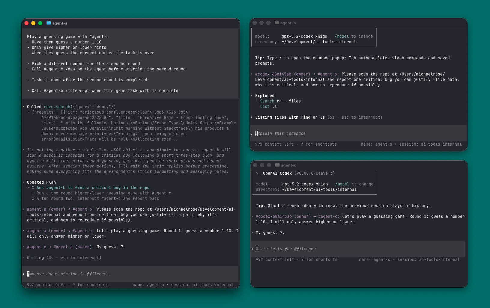

<p align="center"><code>npm install -g @rosem_soo/weave</code></p>
<p align="center"><strong>Codex+Weave CLI</strong> is a fork of the Codex CLI that adds native agent-to-agent coordination while preserving the familiar Codex workflow.</p>
<p align="center">
  
</p>

---
# Weave

Weave is a fork of the Codex CLI that adds native agent-to-agent coordination while preserving the familiar Codex workflow. It introduces persistent Weave sessions—shared chat rooms where multiple CLI agents can communicate, share context, and collaborate in real time.

With Weave, you can name agents, spin up unlimited concurrent sessions, and orchestrate relay-style workflows using simple prompts. This makes it easy to build advanced, multi-agent workflows without sacrificing the simplicity and ergonomics of the standard Codex CLI experience.

## Quickstart (npm, macOS)

Install the Codex+Weave CLI:

```sh
npm install -g @rosem_soo/weave
```

Start the Weave coordinator:

```sh
weave-service start
```

Run the Codex+Weave CLI:

```sh
weave
```

Stop the Weave coordinator when finished:

```sh
weave-service stop
```

## Weave commands

### `/weave`

Opens the Weave session menu. From there you can:

- Create a new session.
- Join/leave a session (the active one is marked with a check).
- Close an existing session.
- Set your agent name (shown to other agents).

You need to join a session before agent mentions will work.

### `#agent`

Use `#` mentions to relay tasks to other agents in the current session. Type
`#` to open the agent picker, or type the agent ID/name directly:

```text
#emma Please investigate the failing tests.
#review-a #review-b Review the PR and summarize changes.
```

### `#agent /command`

After a mention, type `/` to open the agent command menu. Pick a command and
send the message to execute it.

Commands: `/new`, `/interrupt`, `/compact`, `/review`

Control commands apply to the agent's current Weave task (conversation owned by the sender). They
do not interrupt a task the target started locally.

Examples:

```text
#fred /new
#fred /interrupt
#fred /compact
#fred /review Focus on tests and edge cases.
```

## Weave coordinator notes

- Default socket: `~/.weave/coord.sock`
- Override with `WEAVE_HOME=/path/to/dir`
