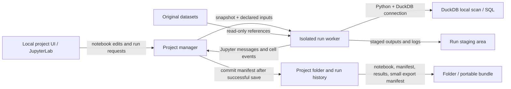

# Local-first notebook and data workspace proposal

**Stage:** D-V14-B-SCOPE-R002-control-diagnostic-a001 (V14)  
**Status:** research proposal; no product implementation or full runtime validation performed.

## Decision

Build a local project shell around existing Jupyter notebook documents and a narrow Python execution profile. Use JupyterLab as the notebook editor, Jupyter’s standard kernel protocol and `nbclient` as execution components, and DuckDB’s Python library as the bounded local scan/SQL engine. Keep datasets referenced in place and read-only by default. Add a project manifest, immutable run records, output status/diff views, and an OS-level execution supervisor; these are the product-specific work. Do not build a new notebook format, general kernel framework, database server, or broad SQL compatibility layer.

Support CPython notebooks under one locked environment per project. Optional SQL means DuckDB SQL, invoked through the Python binding or managed `.sql` transforms. It does not mean a separate general-purpose SQL kernel. Notebook files remain ordinary `.ipynb`; a sidecar manifest carries provenance that the interchange format does not define.

JupyterLab and DuckDB are independently useful precedents: JupyterLab/Jupyter client operate through the kernel/document protocols, while DuckDB is an independently maintained embedded analytical engine with a Python API. Neither project supplies the proposed project identity, data contract, per-cell current/stale state, or isolation policy. Their integration and the exact compatible release set remain product work.

## Evidence, inference, and choices

### Source facts

- Jupyter’s standard notebook format stores an ordered cell list, execution counts, and saved outputs. It does not define a complete source-data, dependency-lock, or run-event provenance record; custom metadata may be ignored by other readers. [S02]
- The Jupyter message protocol gives execution requests and their IOPub side effects a request/session context; it also has a separate control channel used for control operations. `nbclient` can execute cells sequentially, set timeouts, and expose cell lifecycle/error hooks. Those mechanisms can drive a recorder and progress UI, but neither establishes a security boundary or reproducibility by itself. [S03, S04]
- Jupyter Server’s security guidance states that access to the server allows arbitrary code execution. Authentication protects server access; it does not isolate notebook code from the operating system. [S05]
- DuckDB’s CSV auto-detection infers dialect, header, and types from a sample; its documented default type sample is 20,480 rows. A regular seekable CSV can be sampled at different locations, while a non-seekable/compressed CSV is sampled from the beginning. Explicit options can override inference. [S06]
- DuckDB’s JSON reader also samples for type inference; its documented default is 20,480 objects, and automatic detection samples up to 32 files by default. `union_by_name` is opt-in for multiple files. The typed reader maps absent keys to SQL `NULL`; newline-delimited JSON parsing errors are not ignored by default, although an `ignore_errors` option exists. [S07]
- DuckDB documents larger-than-memory processing by spilling to disk for grouping, joins, sorting, and window operators, with material limitations: combinations of blocking operators may still run out of memory; `list`, `string_agg`, some ordered aggregates, and `PIVOT` can exceed memory. [S09]
- DuckDB’s order-preservation page documents clauses that preserve input order and operators that do not. Joins, grouping, sampling, and `ORDER BY` are not a general stable-order guarantee; an explicit total sort key is needed where output order is contractual. Its OOM guide also warns that the configured memory limit may not cover all allocations and suggests lower limits, fewer threads, and disabling insertion-order preservation for some large imports/exports. [S08, S10]
- DuckDB’s Python API can query CSV, JSON, Parquet, and in-memory Arrow/Pandas/Polars inputs. Relations may execute lazily, and module-level `duckdb.sql()` uses a shared global connection that is not thread-safe; a separate connection per thread is recommended. [S11]

### Engineering inference

- A saved cell output and an execution count cannot answer “which source bytes and environment produced this?” A small sidecar keyed by notebook/cell/run, plus event capture from the protocol, is required.
- Arbitrary Python has dynamic state and undeclared I/O. Static dependency analysis cannot safely prove which earlier cells or files an output depends on. The honest default is conservative invalidation and an `unverified` label for interactive execution.
- DuckDB’s documented spill support makes a 5 GB input a reasonable target for selected scans and operations, but its documented exceptions and Python materialization paths make a blanket “5 GB fits” promise indefensible. Resource-bounded operation-specific validation is required.
- Treat parser inference as a proposal, not as a dataset guarantee. A sample can drive preview and an initial schema suggestion; only an explicitly requested full scan can validate that schema over the input presented at that time.

### Product choices

- Use a local folder as the exchange unit. Keep originals where they are unless the user asks to copy them into the project. Store derived outputs separately.
- Support one Python implementation family (CPython), one tested minor/runtime profile per application release, and package sets resolved to exact versions and hashes in a project lock. Projects requiring other Python implementations, kernels, arbitrary package installation, or unapproved native extensions are unsupported until separately qualified.
- Limit SQL to DuckDB dialect and local files/project outputs. Do not add a separate SQL kernel or connect to a shared database service in the minimum product.
- A `current` output means a successful clean replay against the exact recorded notebook/code, data, schema/parser contract, environment, and declared parameters. Interactive outputs are `unverified` even when they look plausible.
- Do not mutate imported source files. A parse/conversion error stops the run; any optional quarantine is explicit, separately written, counted, and linked to the untouched source.

## Components and project record



The manager owns project locking, hashing, UI state, output commits, and exports. Notebook code runs in a separate OS-isolated worker, not with the UI’s ambient credentials. A clean run receives a snapshot of the notebook and declared code/config inputs, read-only mounts for data references, a locked environment, a private temporary home, and a fresh kernel. Only the run’s staged-results directory is writable for durable outputs. The user edits/saves project files through the manager; the worker does not need ambient write access to the project tree.

One portable layout is:

```text
project.toml                  project UUID and format version
notebooks/*.ipynb             standard notebook documents
transforms/*.py, *.sql        declared source transforms
environment.lock              exact Python packages/build hashes
inputs.json                   logical names, paths, fingerprints, contracts
results/<run-id>/             committed exports and output blobs
.workspace/manifest.json      current project record and commit pointer
.workspace/events/*.jsonl     append-only execution events
.workspace/cache/             content-addressed, eligible cache entries
.workspace/staging/<run-id>/  uncommitted run/save material
```

The small manifest records: project UUID/format version; relative notebook and transform IDs; environment-lock digest and runtime/platform profile; dataset logical ID, original path or bundle-relative path, format, full-byte SHA-256, size, import/parser options, confirmed schema and schema version; declared parameters; run ID and mode; cell ID/code digest; event sequence and kernel session; outputs and their digests; status; and cache provenance. The source file’s content hash identifies exact bytes, not a semantic table. For multi-file inputs, hash a sorted manifest of relative names, sizes, and per-file hashes. Stat data is only a fast change hint; a clean replay verifies the full digest before treating data as current.

A folder/bundle contains references and derived outputs by default. It includes raw datasets only by explicit choice. On another machine, unresolved or changed source references are shown as missing/stale and require remapping followed by full fingerprint verification. The manifest must not contain credentials, private account profiles, or tokens.

## Minimum workflow

| User action | Product behavior and evidence kept |
|---|---|
| Create project | Create a versioned folder, UUID, notebook directory, lock placeholder, manifest, and write lock. A project opened on an unsupported runtime remains viewable but cannot claim clean replay. |
| Import/identify data | Register a path without copying by default; identify format and file set; record size/hash and explicit read options. Do not follow a resolved path outside approved read-only mounts. Show full-hash progress for large inputs. |
| Inspect/preview | Show a bounded preview with row/byte limit, parser sample scope, detected schema, null policy, and whether inference is sample-only. Preview describes only those rows/bytes; it is not evidence about every row. |
| Author transform | Open `.ipynb` in JupyterLab or edit a declared `.py`/`.sql` transform. Preserve the standard document. Python is primary; `.sql` uses DuckDB dialect. |
| Run selected work | Run in a long-lived isolated interactive kernel. Record request/session/cell events and the source/code/environment snapshot. Mark resulting output `unverified`, because hidden kernel state and earlier executions may affect it. |
| Request clean replay | Start a fresh kernel, run code cells top-to-bottom against the locked environment and declared files, display progress/errors, accept cancellation, and stage outputs. A selected clean cell range must also run its declared prerequisites; absent a dependency declaration, run the whole notebook. |
| Compare provenance | Compare current notebook/data/environment digests with each saved run; display changed fields, cells, files, schemas, and result hashes. Use structural diff only with a validated row key; otherwise report positional comparison as uncertain. |
| Save/reopen/share | Commit a complete run generation, save the `.ipynb` normally, reopen and verify references/lock, then export selected results plus a compact manifest and status summary. Never imply that a portable notebook alone carries a replay guarantee. |

## Dataset contract and unsupported inputs

### Schema, conversion, and errors

Show separate **inferred schema** and **accepted schema**. Record field names, physical/logical types, nullability, source format/dialect/encoding, explicit null tokens, timestamp format/time zone assumptions, and conversion policy. Keep strings/bytes from the source available for diagnostics. A preview-only inference is provisional. Before a clean result is `current`, strict validation scans all relevant rows/files against the accepted contract.

- CSV: require an explicit decision for delimiter, header, quoting/escape, encoding, empty-string/null tokens, and date/time interpretation where inference is ambiguous. Automatic detection may suggest these, but they remain recorded choices. Do not treat the 20,480-row default as whole-file proof; compressed input may only be sampled from its beginning. A new value that fails a confirmed conversion stops with file and logical record/column details. Do not silently drop it.
- NDJSON: record object format and field/type policy. Missing keys and explicit JSON `null` are distinct in the raw source, but DuckDB’s typed reader maps missing keys to SQL `NULL`. If users need the distinction downstream, retain a field-presence bit/raw JSON or reject a projection that collapses it; only collapse it through a declared transform. For multiple files, schema union is explicit; inference over the first 32 files is not proof about the rest. Default parse failure is an error. Do not expose `ignore_errors` as a silent recovery path.
- Parquet: inspect every file’s schema in a file set. Added/removed/renamed fields or changed types produce a schema-change event. Default action is stop and ask for a reviewed migration; additive nullable fields may be accepted through an explicit migration. Do not assume partitions or files all share the first file’s schema.
- Heterogeneous columns: keep a raw string/JSON representation or define an explicit union/normalization transform. Do not cast by a sample and silently coerce later values. Preserve Unicode as supplied; do not normalize text unless the transform says so. Timestamp conversion must state format and timezone rule; never assume the workstation’s local timezone invisibly.
- Malformed record: fail the attempted run, identify the input and record locator, preserve the original, and keep prior committed output as a historical generation marked stale/unverified. An explicit quarantine option may copy malformed raw records plus reason/count to a separate artifact; it must report how many records were excluded and cannot produce a `current` full-data result unless the user explicitly accepts that changed dataset contract.

### Identity, order, and preview

For a declared unique business key, validate uniqueness and use that key for row association. Otherwise use a source locator (dataset-byte digest plus parser record ordinal; for a multi-file set, file-relative identity plus record ordinal) and label it snapshot-local. CSV logical record ordinals must not be confused with physical line numbers because quoted fields can span lines. Parquet row locators need implementation validation. After joins/aggregates, preserve explicit source IDs or define a derived key; if neither works, structured row-by-row diff is unavailable.

Relational results are unordered unless ordering is defined. DuckDB preserves order in some documented cases, but not across joins/grouping and other operators, and an `ORDER BY` with ties is not stable. Store `ordering: explicit|source-preserved|unspecified`, the exact ordering expressions, and tie-breaker. When stable output is required, sort by a total key (including a unique tie-breaker); do not rely on engine default or a preview sample’s apparent order. [S08]

The default preview can show the first bounded records and optionally a deterministic recorded sample. Store sample method, seed/offsets, row/byte limit, input digest, and schema-inference scope. It says what was inspected, not that all records have that type or property. Full validation is a separate, visible scan.

## Notebook state, clean replay, and output status

The displayed cell order is document order. `execution_count` is only a notebook-level count and the saved output list is not a provenance graph. Capture actual requests and replies from the kernel protocol: notebook/cell stable ID, code digest at execution time, visible position, request message ID, session ID/epoch, monotonically increasing project event ID, mode, start/end, status, error, and output digest. The protocol’s message parent/session context can associate IOPub output with the execution request. [S02, S04]

Use these UI labels consistently:

- **Current:** output from the latest complete successful clean replay, and all recorded inputs, code, schema/parser contract, parameters, and environment still match.
- **Stale:** a known dependency or code/input signature changed since the associated output.
- **Failed:** the latest attempt for that cell failed. Keep the prior saved output as a separate stale historical result; do not replace it with a partial result and label it current.
- **Unverified:** imported output without a manifest, interactive output, mismatched/unavailable provenance, or output produced by a partial/cancelled run.

At run start, show a progress event and mark affected old output stale/unverified. A cell failure marks that attempt failed; dependent cells do not run. A cancelled clean run may expose partial diagnostic output under the attempt record as unverified, but it does not commit a current-output generation. On kernel restart, change the session epoch, discard live-state claims, and mark outputs from that interactive session unverified until a clean replay. This avoids treating old results as current merely because they remain visible in the notebook.

Conservative invalidation rules:

| Change | Invalidate |
|---|---|
| Edit a code cell | That cell and every later code cell in that notebook; Python global state makes a narrower static claim unsafe. |
| Move/reorder cells | Moved cells and following execution-dependent cells; clean replay order follows the saved document order. |
| Change a source file, file set, parser option, schema, or accepted conversion | All outputs that declare that dataset dependency; if the dependency is undeclared, the worker cannot read it and the run cannot be marked current. |
| Change package lock, Python/kernel, DuckDB build, or permitted extension | All outputs produced in that environment. Require an explicit environment rebind then replay. |
| Restart/interrupt kernel or lose event association | Interactive outputs become unverified; outputs from interrupted work do not become current. |
| Edit/replace a saved output outside the manager | Digest mismatch makes the output unverified. |

For Python, this deliberately invalidates a suffix rather than guessing dependencies. A future explicit cell dependency graph can narrow invalidation only for transforms proven pure and declared. Do not treat static import scanning as proof of all file/network/global-state dependencies.

A clean replay can promise that the product started a fresh kernel, used the recorded locked environment and declared inputs, ran the selected notebook cells in recorded order, and associated captured outputs/errors with the requests. With matching runtime/platform and hermetic deterministic code, the project can compare output digests and explain differences. It cannot promise bit-for-bit identical results in general: random or time-dependent code, thread scheduling, floating-point/BLAS or hardware differences, external services, dynamic package installs, undeclared environment/file access, and nondeterministic native libraries can change results. Network and undeclared host paths are denied by default; opting into external access makes affected outputs unverified unless the response is separately captured and declared.

## Execution and workstation boundary

Notebook code is arbitrary code. Run the Jupyter server and kernel within a per-run OS isolation boundary (prefer a disposable VM where a maintained sandbox profile is unavailable). Use an unprivileged identity, no host home/credentials, read-only source and code mounts, writable isolated temporary/output staging only, network disabled by default, read-only locked environment, process/CPU/memory/disk/time limits, and terminate the process tree on cancel/timeout. Do not rely on an import blacklist. The worker is discarded after a clean replay; interactive kernels are isolated per project and have an explicit restart/cancel control.

For the 8-core/16 GB investigation target, start qualification with up to 6 worker threads, a 6 GiB DuckDB limit, a separate worker RSS cap around 9 GiB, and a configurable spill-disk quota. These are conservative proposed starting limits, not benchmark results; DuckDB’s own guide warns that its memory limit does not cover every allocation and suggests 50–60% of system RAM in some OOM cases. Tune only from measured end-to-end worker RSS, spill usage, and host responsiveness. Do not run several 5 GB clean jobs concurrently by default.

A bounded preview and streaming/batch transform should work without collecting the whole table into Python. DuckDB can spill supported plans to disk, but combined blocking operations, some aggregates, pivots, and `.df()`/`fetchall()`-style full materialization can exceed the envelope. Before running a known full materialization, show estimated/unknown size and require an explicit choice or reject it under policy. If a plan runs out of memory/disk, fail visibly, preserve the source and prior committed outputs, retain diagnostics, and offer a smaller plan/batch or different output format. A 5 GB success claim awaits the proposed benchmark below. [S09, S10, S11]

For SQL concurrency, each worker owns an explicit DuckDB connection and isolated scratch/catalog; never share module-global `duckdb.sql()` across project threads. Serialize commits to the project manifest/catalog. Parallel clean workers can use separate scratch databases and stage outputs; a result commits only if its notebook and input snapshot still match the base snapshot. The docs specifically warn about the shared global Python connection; cross-process persistence/locking still requires qualification. [S11]

Use content-addressed caching only for declared pure SQL/data transforms. Key it by transform bytes, full source digests, parser/schema contract, parameters, exact runtime/environment lock, engine build, and relevant ordering options. Python cell outputs are not reused by default because side effects and dynamic dependencies are opaque. Cache hit provenance is visible; any changed component invalidates the entry. Never let a preview cache imply full-file validation.

For large outputs, embed only a bounded display (for example, a configured row and byte ceiling) and record that it was truncated. Store full results as separate files with schema, ordering, size, and hash. Compare schemas and full hashes first; calculate full row-level diffs only when row identity is sound. Otherwise show bounded examples and label the comparison incomplete. Render untrusted HTML/SVG/widget outputs in a restricted viewer or sanitize/disable active content; do not execute notebook-produced JavaScript in the project manager’s origin.

For save/recovery, write a complete run into a new staging generation, flush output and event records, validate hashes, then atomically replace one small manifest/commit pointer last. Save notebook files through temp-file plus atomic replace. On reopen, ignore unreferenced staging generations and reconcile a partial event tail as interrupted/unknown; never repair it into `current`. A project lock serializes manifest/notebook writes. Detect external edits by digest and ask the user to reload/compare rather than last-writer-wins. Network/shared filesystems and cross-platform atomic rename/locking semantics are unsupported until tested.

## Opportunity and plausible alternative

**Useful opportunity:** DuckDB’s `sniff_csv` can return detected settings and a ready-to-use read command; the UI can present that as an editable, saved “import recipe,” then let the user promote it into a strict schema contract. DuckDB also reads and returns Arrow/Pandas/Polars data in Python, enabling a small interoperability path without building another tabular kernel. Keep ownership and conversion visible; the documented inputs are read-only through the query API. [S06, S11]

**Plausible alternative:** keep the same `.ipynb` files and environment contract but ship a thin CLI/`nbclient` replay tool first, letting analysts keep their existing notebook editor. That lowers editor integration cost and tests the manifest/replay core, but postpones the shared preview, accessible per-cell status, and output-diff workflow. `nbformat` plus `nbclient` make this a credible bounded route; it is an alternative to qualify, not the selected minimum UI. [S02, S03]

## Consequential failure/fix/test chain and evidence limits

DuckDB issue [#7789, “read_csv_auto fails on CrashStatistics.csv”](https://github.com/duckdb/duckdb/issues/7789) reports a file that worked with DuckDB 0.7.1 and failed on 0.8.0 near row 3,219 under a default `sample_size=20480`, with a quote-configuration parse error. In the issue discussion, a maintainer attributed it to the sniffer trying option combinations over only one chunk and proposed a state-machine approach. [S12, S13]

DuckDB PR [#8253, “CSV Sniffer – State Machine”](https://github.com/duckdb/duckdb/pull/8253) was merged to `main` on 2023-09-04 as `3b58f4490f4c9192a8ff4dbd4fcea134be3106a2`. Its description says the new state machine examines `options.sample_chunks` and addresses #7789. It also calls out that type detection/refinement has its own sample limits and that sampling different parts of very long inputs remained future work. The `v0.9.0` source tree contains `test/sql/copy/csv/parallel/test_7789.test`, which uses `SAMPLE_SIZE=-1` and asserts count `4980`. This establishes the stated mechanism, merge identity, and presence of a regression oracle in that tag’s source. [S14, S15]

**Limit:** issue comments report inconsistent development snapshots after the merge; the reporter later says a particular `main` snapshot works, but the cited SHA is not the CSV fix commit. The checked-in v0.9.0 test file does not prove this candidate ran the test, that a v0.9 binary passed it, or that every later release is correct. The chain therefore supports a historical failure, an intended merged fix, and a regression test in v0.9.0 source, while the exact first fixed released binary and the cause of the intervening snapshot disagreement remain unverified. Do not extrapolate this fix to every parser behavior or current DuckDB release.

## Implementation plan and validation gates

1. **Resolve the critical runtime profile.** Select and lock one compatible exact set of CPython, JupyterLab/Server, `ipykernel`, `jupyter-client`, `nbformat`, `nbclient`, DuckDB Python/engine, native libraries, OS/architecture, and sandbox backend. The researched documentation versions are not evidence that one combination was installed or tested. Prove clean launch, interrupt, event/output association, and notebook open/save on each supported OS. If a platform lacks a tested isolation backend, allow project viewing/editing but disable code execution there.
2. **Implement project/import contracts.** Add project IDs, source references and hashes, parser options, schema versions, previews with sample scope, strict full scans, and clear malformed-record errors. Validate CSV/NDJSON/Parquet cases covering Unicode, missing versus null, timestamps, mixed types, multiple-file schema drift, malformed input, and original-file immutability.
3. **Add run/event/provenance state.** Capture interactive versus clean events, per-cell digests, session/request IDs, status, logs, output association, data/environment hashes, cancellation, and conservative invalidation. Verify imported/edited notebook outputs become unverified/stale and failures/restarts cannot leave misleading current badges.
4. **Add staged save, compare, and exchange.** Test crash injection between output flush and commit pointer; recovery must select the prior committed generation. Test external edit detection, concurrent workers, lock release after process death, reopen/remap on a second machine, portable folder/bundle export, and accessible status/error announcements.
5. **Qualify the workstation target before marketing it.** On an ordinary 8-core/16 GB system, use synthetic and representative 5 GB CSV, NDJSON, and Parquet inputs. Measure peak worker RSS, temporary disk, elapsed time, output hashes and host responsiveness for bounded previews, projection/filter streaming, supported out-of-core joins/group/sorts, and the known failure-prone combined/pivot/list/materialization cases. Confirm cancel leaves inputs and prior outputs intact. No 5 GB run was executed in this research.

Current observed documentation labels are JupyterLab 4.6.4, Jupyter Server 2.21, `jupyter-client` 8.10.0, `nbformat` 5.11, and `nbclient` 0.11-series; DuckDB current documentation at the captured `duckdb-web` commit is labeled 1.5. These are research references, not a mutually tested dependency lock. Exact wheel/build versions, compatibility, extension policy, sandbox implementation, file-lock semantics, and 5 GB performance are critical unresolved dependencies. [S01-S11]

## Checks performed

One candidate-authored, standard-library-only witness was executed through the admitted isolated Python capability. Its three synthetic JSON-like records included Unicode, an explicit null, and an absent field. It sorted only by an asserted unique ID, checked that absence differs from null in the witness representation, and verified that changing source rows, code bytes, or the environment-lock value changes a content signature. It exited 0 and printed the expected summary. This checks a small proposed contract/key component; it does not run Jupyter, DuckDB, a notebook, a real file parser, a 5 GB path, a sandbox, or the product. Exact code/input and receipt are in `witnesses.json`.

All other validation in this proposal is **proposed/UNEXECUTED**. No package was installed, no downloaded source code was executed, no full application or engine behavior was tested, and no private data or credentials were accessed. Sources were selected from the supplied brief and inspected as public evidence; this work is not an evaluation of autonomous source discovery by a product.